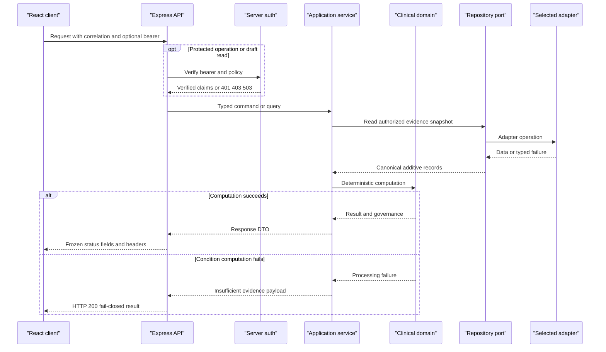

# Preserved API And Service Contracts

## Contract Authority

Existing method, path, request names, response fields, status meanings, headers, authorization rules, and observable ordering are frozen. Additive response fields require a named compatibility need and must not change existing field meanings. The detailed source-anchored authority remains `wire_contracts.yaml` and each unit's `behavior.yaml`/`bindings.yaml`; this document fixes target placement.

## Global HTTP Contract

All responses carry `x-correlation-id`. Incoming correlation precedence is `x-correlation-id`, then `x-request-id`, then generated UUID-compatible ID. Structured start/finish/error logs contain timestamp, correlation ID, method, path, query, status, and duration where applicable; they exclude authorization headers, tokens, and bodies.

CORS uses configured origins, local defaults `http://localhost:5173` and `http://localhost:5174`, methods `GET, POST, PATCH, OPTIONS`, and headers `Authorization, Content-Type, X-Correlation-Id`. Production without an allowlist allows no origin.

Every response has `x-content-type-options: nosniff`, `x-frame-options: DENY`, `referrer-policy: strict-origin-when-cross-origin`, `permissions-policy: camera=(), microphone=(), geolocation=(), payment=()`, and `cache-control: no-store`. Production adds `strict-transport-security: max-age=31536000; includeSubDomains`.

JSON bodies are limited to 1,000,000 bytes. Overflow is `413 {"error":"Request body exceeds the 1 MB limit"}`. Unhandled errors are sanitized to `500 {"error":"Internal server error","correlationId":"..."}`. Route-specific envelopes take precedence.

## HTTP Endpoint Inventory

| # | Method and path | Access | Success contract | Error contract / target handler |
| --- | --- | --- | --- | --- |
| 1 | `POST /api/clinical-ai` | Public | `200 {status:'success'\|'fallback',source,content,error?}` | Provider/missing-key returns deterministic `200 fallback`; `clinicalAiHandler`. |
| 2 | `GET /health` | Public | `200 {ok:true,service:'salus-api',motto:'The evidence behind every path to healing.'}` | Global envelope only; `healthHandler`. |
| 3 | `GET /auth/editor-status` | Authenticated | `200 {authenticated:true,actorEmail,groups,isEditor}` | 401 missing/invalid; 503 auth config; `editorStatusHandler`. |
| 4 | `GET /conditions` | Public | `200 MedicalCondition[]`, including empty | Global envelope; validate serialized rows; `listConditionsHandler`. |
| 5 | `POST /conditions` | Editor | `201 MedicalCondition`, then `condition.create` audit | 400 flattened validation; 401/403/503 auth; `createConditionHandler`. |
| 6 | `GET /evidence` | Public; editor for drafts | `200 {metadata:{causalEquivalencyDisclaimer,message,pagination,query},rows}` | 401/403/503 for unauthorized drafts; `listEvidenceHandler`. |
| 7 | `GET /evidence/export.csv` | Public; editor for drafts | UTF-8 CSV, fixed 15 columns, attachment `salus-evidence-export.csv` | 401/403/503 for unauthorized drafts; `exportEvidenceCsvHandler`. |
| 8 | `POST /evidence` | Authenticated | `201 TreatmentEvidence` forced to draft, then `evidence.create` audit | 400 validation/unknown condition; 401/503; 409 duplicate; `createEvidenceHandler`. |
| 9 | `PATCH /evidence/:id/publish` | Editor | `200 TreatmentEvidence` and exact `evidence.<status>` audit | 400 missing/invalid status; 401/403/503; 404 absent; `publishEvidenceHandler`. |
| 10 | `GET /intelligence/condition/:conditionId` | Public; editor for drafts | `200 ConditionIntelligence` plus governance | Missing ID 400; computation failure is frozen fail-closed 200; `conditionIntelligenceHandler`. |
| 11 | `GET /intelligence/evidence/:evidenceId` | Public; editor for drafts | `200 EvidenceIntelligence` | Missing ID 400; absent 404; auth errors for drafts; `evidenceIntelligenceHandler`. |
| 12 | `GET /intelligence/gates/:conditionId` | Public; editor for drafts | `200 ValidationGateReport` | Missing ID 400; auth errors for drafts; `governanceGatesHandler`. |
| 13 | `GET /intelligence/interaction/:conditionId` | Public; editor for drafts | `200 {conditionId,interventionA,interventionB,timeline,generatedAt}` | Missing ID/pair 400; auth errors; `interactionTimelineHandler`. |
| 14 | `GET /intelligence/trajectory/:evidenceId` | Public; editor for drafts | `200 {evidenceId,trajectory,generatedAt}` | Missing ID 400; absent 404; computation 500; `trajectoryHandler`. |
| 15 | `GET /intelligence/dose-optimizer/:evidenceId` | Public; editor for drafts | `200 DoseOptimizationResult` | Missing ID 400; absent 404; computation 500; `doseOptimizerHandler`. |

The source-backed inventory above contains 14 archived routes plus the active clinical-AI route. Downstream validation must use this enumeration even though `t3-pm.md` summarizes the archive as 13 contracts.

## Query And Serialization Rules

- Evidence list inputs are `conditionId?`, `includeDrafts?`, `q?`, `limit?`, and `cursor?`. Limit defaults to 25 and clamps to 1..100. Cursor is a nonnegative decimal offset string on input/`nextCursor`, while metadata `cursor` remains numeric.
- Evidence search is case-insensitive over identity, condition, medical system, intervention, grade, methodology, registry, outcome, contraindications, and interaction warnings. Sorting is descending `lastVerifiedDate`, then ascending `evidenceId`.
- CSV order and names are `evidenceId,conditionId,medicalSystem,interventionName,isPharmacological,evidenceGrade,studyMethodology,sampleSize,registryIdentifier,sourceUrl,clinicalOutcomeSummary,contraindications,interactionWarnings,publicationStatus,lastVerifiedDate`. Arrays join with ` | ` and RFC-style quoting protects commas, quotes, and newlines.
- Intelligence mode is `public|clinician`, default public. Explicit `strictGates=true|false` overrides server default. Draft inclusion always requires editor access.
- Interaction hours default to 48 and clamp to 6..168. Trajectory hours default to 72 and clamp to 6..168. Dose optimization defaults sample size to 100 and patient weight to 70.
- Canonical reads accept `draft|published|rejected|under_review|undefined`; public visibility is only `published|undefined`. `POST /evidence` always writes draft. Publish PATCH accepts only `draft|published|rejected` and rejects `under_review`.

## Shared DTO Contracts

`MedicalCondition`, `TreatmentEvidence`, `AuditRecord`, monitoring snapshots, intelligence results, gate reports, trajectories, dose results, and import results live in environment-neutral shared/domain modules. Existing serialized field names are retained. Request schemas reject unknown publication writes rather than coercing them; readers preserve unknown additive DynamoDB attributes when projecting known fields.

Validation retains the four medical systems, A/B/C grades, HTTPS source URLs, allowed source domains, and registry prefixes `PMID|DOI|CTRI|ICTRP|AYUSH|DHARA|NCT`. Root analytical fields are additive to archived evidence and condition shapes.

## Repository Service Contracts

| Operation | Success | Stable failure/side effect |
| --- | --- | --- |
| `ConditionRepository.upsert` | Returns serialized condition | Editor command appends `condition.create` audit after persistence. |
| `EvidenceRepository.createSubmissionDraft` | Creates once and returns draft | Duplicate identity is typed conflict -> HTTP 409; unknown condition is HTTP 400 before write. |
| `EvidenceRepository.updatePublicationStatus` | Conditionally updates existing row | Missing is typed not-found -> 404; audit follows exact transition. |
| `EvidenceRepository.list` | Same filters/visibility/sort inputs across adapters | Adapter failure surfaces; no adapter substitution. |
| `EvidenceRepository.createImportedDraft` | One conditional first write | Conditional conflict -> skipped; all other failures abort/surface. |
| `EvidenceRepository.saveIfFresher` | Writes only when incoming verification date is newer | Existing newer/equal row returned unchanged. |
| `AuditRepository.append` | Append-only record with 90-day expiry | Failure is observable and never reported as successful audit. |
| `SeedService.ensure` | Idempotent inserted counts and mode | Missing persistent table contract returns explicit skipped result; no destructive update. |

## Cognito-Compatible Contracts

Browser authorize uses `{domain}/oauth2/authorize` with authorization code, client ID, redirect URI, scopes, random state, `code_challenge_method=S256`, and challenge. Callback validates state before `{domain}/oauth2/token`, uses form-encoded code/verifier exchange, session-stores access token/expiry, removes transient PKCE values, scrubs callback query parameters, and allows return only to `/`, `/new`, or `/editor`.

Server bearer verification requires `COGNITO_ISSUER` and `COGNITO_AUDIENCE`, resolves `{issuer}/.well-known/jwks.json` through a cached remote key set, and verifies signature, issuer, audience, expiration, and validity. Claims normalization preserves email and `cognito:groups`; exact `evidence-editors` membership is the editor predicate.

## Ingestion Contracts

| Connector | Input/output | Failure and idempotency |
| --- | --- | --- |
| PubMed | PMID inputs -> normalized evidence drafts and `{source:'pubmed',ingested,skipped,reason?}` | Missing table is explicit; conditional conflicts skip; no overwrite. |
| ClinicalTrials.gov | Configured query, bounded fetch -> NCT IDs and source timestamp | Typed bounded HTTP failure; deterministic sample/fallback marker retained. |
| AYUSH/DHARA | Configured URL -> AYUSH/DHARA references and timestamp | `rows\|records` parser tolerance; deterministic fallback retained. |
| CTRI/ICTRP | Configured URL -> CTRI/ICTRP references and timestamp | `trials\|records` parser tolerance; deterministic fallback retained. |

Shared HTTP policy exposes attempts, status, retryability, and error kind. It enforces configured timeout, retry statuses/count, minimum interval, and request cap. Source connectors never own repository selection or direct DynamoDB commands.

## Primary Service Sequence

<!-- mermaid-checked: every participant uses `participant Id as "Label"`, no \n in aliases/messages/notes, every alt/opt/loop closed by end, no `:` inside any alias -->

## Upstream Artifacts Consumed

- `.github/modernize/rearchitecture/artifacts/wire_contracts.yaml` - source-located outward contracts and target handler semantics.
- `.github/modernize/rearchitecture/artifacts/data-model.md` - persisted/browser shapes, indexes, validation, and transaction boundaries.
- `.github/modernize/rearchitecture/artifacts/t2.1-architect.md` - binding ADR-01 through ADR-06.
- `.github/modernize/rearchitecture/artifacts/t3-pm-capability-inventory.md` - HTTP requirements REQ-050 through REQ-072.

## Evidence Mapping

- `wire_contracts.yaml#express-global-middleware` -> global HTTP contract.
- `wire_contracts.yaml#active-clinical-ai` and `#health` through `#dose-optimizer` -> endpoint rows 1 through 15.
- `wire_contracts.yaml#cognito-authorize/#cognito-token/#cognito-jwks` -> browser/server Cognito contracts.
- `wire_contracts.yaml#*-source/#pubmed-evidence-write` -> ingestion contracts.
- `data-model.md#Validation-And-Referential-Rules` -> shared DTO and repository contracts.
