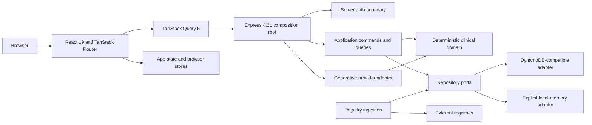

# Target Architecture

## Runtime Boundary

The target is a self-contained TypeScript application rooted at `/Users/rraviku2/aarti/salus-pramana-medical-new`. It may copy static assets and reimplement behavior from the current repository, but target runtime imports, build inputs, tests, and startup commands must not resolve files from the current root or `archive/legacy-monorepo`.

Required package lines are React 19, Vite 8, Tailwind CSS 4, TanStack Query 5, TanStack Router 1, Express 4.21, and Node.js 22. Use one lockfile and one application package so client, server, shared contracts, and deterministic domain code cannot drift through duplicate package versions.

## Target Module Map

| Boundary | Target responsibility | Allowed dependencies | Forbidden dependencies |
| --- | --- | --- | --- |
| `src/client/app` | React root, provider assembly, router, route boundaries, global focus/live regions | client features, shared contracts | Express, AWS SDK, server auth |
| `src/client/routes` | One lazy entry module per route path | client features/components | direct persistence, server modules |
| `src/client/features` | Home, comparison, submission, editor, auth callback, intelligence, ODE, clinical, equity, audit, math, calibration | client services, domain pure functions where browser-safe | AWS SDK, Express |
| `src/client/services` | Typed API client, query keys/options, browser storage, exports | shared contracts | repository adapters |
| `src/client/state` | Persona, modal state, ODE handoff, auth UX snapshot | React only | server-state caching |
| `src/client/theme` | Tailwind 4 tokens and computed light-theme compatibility | CSS/assets | second theme system |
| `src/server/app` | Express construction and ordered middleware/route mounting | server routes/middleware | domain implementation details in handlers |
| `src/server/routes` | HTTP parsing, auth policy attachment, DTO serialization | application services, shared schemas | direct AWS SDK or AI decisions |
| `src/server/auth` | Bearer verification, claims normalization, editor policy | JOSE/JWKS adapter, config | browser session state |
| `src/application` | Use cases coordinating repositories, domain, audit, and ingestion | domain and ports | Express request/response objects |
| `src/domain/contracts` | Additive canonical DTOs and surface-specific mutation schemas | validation library only | React, Express, SDKs |
| `src/domain/clinical` | Pramana, gates, RK4, trajectory, Hill dose, calibration, safety | pure TypeScript | React, Express, AI, repositories |
| `src/domain/export` | Deterministic CSV/JSON/citation/report projection | domain contracts | browser APIs except at outer adapter |
| `src/persistence/contracts` | Repository interfaces and typed failure vocabulary | domain contracts | AWS SDK |
| `src/persistence/dynamodb` | DynamoDB-compatible commands and conditional writes | AWS SDK, ports | Express, React |
| `src/persistence/memory` | Process-local parity implementation and seeds | ports | hidden selection/failover logic |
| `src/ingestion` | Connector policy, parsing, normalization, bounded batches | HTTP port, repository ports | route handlers, direct table writes |
| `src/shared` | Environment-neutral result/error/correlation types | no platform framework | mutable global state |

Dependency direction is `client/server/ingestion -> application -> domain + persistence contracts`; adapters point inward to ports. Cross-boundary imports outside this direction fail architecture review.

## Browser Composition

Provider order is `React.StrictMode -> QueryClientProvider -> AppStateProvider -> RouterProvider`. Auth session access is an API used by the API client and auth-aware components; it is not an authorization provider for protected operations.

Use one TanStack Query client for all server state. Query keys are factories rooted by resource: `conditions`, `evidence`, `intelligence`, `editorStatus`, and `calibration`. Query inputs include every server-visible filter and auth-sensitive option. Mutations do not retry automatically. Queries do not retry actionable 4xx responses; bounded retry is allowed only for transient network/5xx failures. Successful mutations invalidate exact affected keys rather than maintaining a parallel server-state copy in React context.

`AppStateProvider` remains the owner of persona, export/citation modal state, and ODE intervention handoff. Recent searches use IndexedDB with the frozen localStorage fallback. Evidence subscriptions use their versioned localStorage key. PKCE and access-token state remain in sessionStorage.

### Route Topology

| Path | Lazy module | Design placement |
| --- | --- | --- |
| `/` | `home.lazy.tsx` | Preserve active research home; integrate archived dashboard comparison as additive sections/actions, not a replacement shell. |
| `/scientific-audit` | `scientific-audit.lazy.tsx` | Active audit and mathematical defense. |
| `/global-health-equity` | `global-health-equity.lazy.tsx` | Active map and policy simulation. |
| `/cross-system-intelligence` | `cross-system-intelligence.lazy.tsx` | Active ledger and condition intelligence. |
| `/ode-interaction-lab` | `ode-interaction-lab.lazy.tsx` | Active ODE handoff and simulation. |
| `/clinical-workbench` | `clinical-workbench.lazy.tsx` | Active safety and dose workflow. |
| `/ai-clinical-reasoning` | `ai-clinical-reasoning.lazy.tsx` | Active synthesis UX. |
| `/architecture` | `architecture.lazy.tsx` | Active architecture/math/report discovery hub. |
| `/calibration-governance` | `calibration-governance.lazy.tsx` | Active calibration view. |
| `/new` | `new-evidence.lazy.tsx` | Restored authenticated submission. |
| `/compare/$conditionId` | `condition-comparison.lazy.tsx` | Restored condition deep link and empty/submission recovery. |
| `/editor` | `editor.lazy.tsx` | Restored editor console and taxonomy/status operations. |
| `/auth/callback` | `auth-callback.lazy.tsx` | Restored PKCE callback and sanitized return. |
| `/math` | `math.lazy.tsx` | Restored explainer; cross-linked with `/architecture`, without replacing active math surfaces. |

Every route has a module-level pending state, error boundary with retry, document title, route-change focus target, and shared unknown-route recovery. Navigation preserves app-state providers and scroll restoration. Lazy chunk failure must not be cached as a successful service-worker response; only navigation requests may fall back to the SPA shell.

## Express Composition

`createApp(dependencies)` is the only Express composition root. It receives validated configuration, auth verifier, application services, and an already selected repository set. Route handlers are thin translators and never instantiate SDK clients.

Middleware order is fixed: trust/proxy and correlation, request-start log, CORS, security/no-store headers, raw size guard, JSON parser, route-scoped auth, routes, not-found, terminal error and finish logging. The 1,000,000-byte boundary, correlation precedence, CORS methods/headers, security headers, HSTS production rule, and terminal envelopes are frozen in `t4-architect-api-contracts.md`.

The Express process serves `/api/clinical-ai` and the restored root-level API paths. Vite middleware is development-only; production serves built static assets after API routes and uses an SPA navigation fallback that cannot mask failed API or asset requests.

## Authentication And Authorization

`auth/browser` owns authorization-code PKCE S256, cryptographic verifier/state, callback exchange, session expiry, query scrubbing, sign-out, and the allowed return paths `/`, `/new`, and `/editor`. The browser attaches its bearer token but does not infer API permission from possession alone.

`auth/server` verifies every protected request independently: required issuer/audience configuration, cached remote JWKS signature, issuer, audience, validity, email, and `cognito:groups`. Exact `evidence-editors` membership gates taxonomy creation, publication changes, and draft reads. Evidence submission requires authentication but not editor membership. Missing/malformed credentials are 401, authenticated non-editor is 403, and absent server auth configuration is 503. Local bypass is explicit, test/development-only, and rejected when `NODE_ENV=production`.

## Domain And Clinical Decision Ownership

Clinical modules expose pure, deterministic functions for Pramana score/contributions, confidence and intervals, governance gates, RK4 interaction timelines, single-intervention trajectories, Hill dose candidates, safety alerts, calibration, and equity projections. Constants and threshold boundaries remain named exports with golden fixtures.

Application services obtain one authorized evidence snapshot and pass it to both intelligence and governance. Strict gates only downgrade `RECOMMEND` to `INSUFFICIENT_EVIDENCE`. Any condition-intelligence exception returns the frozen zero-evidence HTTP 200 result. AI receives deterministic context and returns explanatory text/source only; its output cannot mutate decision fields, audit data, or persisted evidence.

## Persistence Boundary

The architecture fixes ports; t5 owns exact table/index evolution details.

| Port | Required operations |
| --- | --- |
| `ConditionRepository` | `list`, `get(conditionId)`, `upsert(condition)` |
| `EvidenceRepository` | `list(filters)`, `get(evidenceId, visibility)`, `createSubmissionDraft`, `createImportedDraft`, `updatePublicationStatus`, `saveIfFresher` |
| `AuditRepository` | `append(record)` |
| `MonitoringRepository` | `putSnapshot(snapshot)` with explicit persisted/not-configured outcome |
| `SeedService` | idempotent, non-destructive seed with inserted counts and mode |

Canonical readers accept additive fields, `draft|published|rejected|under_review`, and absent publication status. Absence is publicly readable; all explicit non-published values require editor-authorized draft access. Existing keys, serialized names, unknown additive attributes, both `byCondition` indexes, and old-shape readability remain unchanged. Readers may default missing optional values in projections but must never write those defaults back during a read.

`PERSISTENCE_ADAPTER` is mandatory. `memory` starts only outside production and is process-local; `dynamodb` requires complete table configuration. Missing/unknown mode or incomplete DynamoDB configuration fails startup. Runtime DynamoDB-compatible failures surface through the operation contract and never switch to memory.

Mutation and audit remain ordered, non-transactional effects unless t5 proves a backward-compatible transactional design. API success is emitted only after the required audit append; an audit failure surfaces through the terminal error contract and must be observable by correlation ID. This known partial-effect risk requires retry/idempotency tests.

## Ingestion Architecture

Each registry connector implements `fetch(limit, signal)` and returns parsed references plus source timestamp/fallback metadata. One shared HTTP policy enforces configured timeout, retry count/statuses, minimum interval, and request cap and returns typed timeout, HTTP, network, invalid-JSON, and rate-limit failures.

Connectors do not write storage. Importers normalize each record to an additive `TreatmentEvidence` draft and call `EvidenceRepository.createImportedDraft`. The DynamoDB-compatible adapter performs one conditional create by `evidenceId`; only a conditional conflict increments `skipped`. All other errors fail the job and cannot trigger memory fallback. Repeating an import preserves the first record byte-for-byte.

## Accessibility, Theme, And Browser Architecture

Port `src/index.css` token mappings before component migration. Tailwind utility names are not semantic color truth; computed foreground, background, border, focus, hover, disabled, and contrast states define fidelity. Restored archived screens use this one active-root design system.

Shared primitives own focus-visible treatment, status live regions, dialog focus trap/restore, field error association, target size, reduced motion, table reflow, and chart/map textual alternatives. Feature modules must not create alternate dialog, toast, form-field, or icon-button accessibility behavior.

CSS and browser APIs target the latest two major Chrome, Firefox, Safari, and Edge versions. Avoid engine-specific behavior without a tested fallback. Layout is mobile-first, retains existing breakpoints, supports 400% zoom/reflow, and has no page-level horizontal scrolling.

## Static And Corpus Preservation

Copy `robots.txt`, `sitemap.xml`, `llms.txt`, and `llms-full.txt` unchanged initially, then validate canonical links against the target router. Preserve metadata/manifest, reports, formulas, calibration outputs, print styles, source links, and repository/author/license attribution as discoverable assets linked from `/architecture` and `/math`.

## External Integration Prerequisites

- Cognito-compatible environments must supply browser domain, client ID, redirect URI, scopes, and server issuer/audience values; production cannot use the local auth bypass.
- DynamoDB-compatible mode requires AWS credential resolution, region, and existing condition, evidence, audit, and monitoring table configuration. These resources are consumed non-destructively and are not provisioned by this task.
- AYUSH/DHARA and CTRI/ICTRP live ingestion require approved HTTPS source URLs; ClinicalTrials.gov and all registry connectors require outbound HTTPS access and configured request bounds. Deterministic fallback records remain observable compatibility behavior, not proof of live-source connectivity.
- Non-fallback clinical AI requires a valid Gemini provider key. Missing or failed provider access retains the frozen deterministic HTTP 200 fallback contract.
- Production API access requires an explicit CORS origin allowlist and TLS termination compatible with the frozen HSTS/security-header behavior.

## Risks And Controls

| Risk | Severity | Required control |
| --- | --- | --- |
| PM route count omits one archived HTTP path | HIGH | Preserve all enumerated routes; validation owner reconciles count before gate execution. |
| Active and archived publication enums overwrite each other | CRITICAL | Additive read DTO, surface-specific write schemas, no backfill. |
| Client auth is treated as authorization | CRITICAL | Server verification and negative auth suite on every protected surface. |
| AI or exception path upgrades a clinical result | CRITICAL | Pure deterministic owner, downgrade-only governance, frozen fail-closed fixture. |
| Express middleware order drifts | HIGH | One composition function and boundary tests for every header/error/log step. |
| DynamoDB failure silently becomes memory data | HIGH | Mandatory startup selection and no-failover failure tests. |
| Audit failure follows a successful mutation | HIGH | Correlated observability, explicit retry behavior, and partial-effect tests; no silent success. |
| Concurrent ingestion overwrites evidence | HIGH | Conditional create race suite and byte-for-byte first-write assertion. |
| Tailwind utility names invert the light theme | HIGH | Token-first port and computed-style baselines. |
| Lazy-route/service-worker failure strands users | HIGH | Navigation-only SPA fallback, route retry, chunk-error browser tests. |

## Implementation Completion Evidence

Each implementation task reports target files, matching `behavior.yaml`/`bindings.yaml`/`wire_contracts.yaml` rows, REQ IDs, executable tests, and confirmation that source/archive were unchanged. Architecture conformance requires dependency-boundary checks, one router/query client/provider tree, one Express root, exact endpoint inventory, adapter contract parity, and no unresolved HIGH/CRITICAL findings.

## Upstream Artifacts Consumed

- `.github/modernize/rearchitecture/artifacts/t2-architect.md` and its linked global/per-unit artifacts - implementation units, seams, data shapes, and frozen contracts.
- `.github/modernize/rearchitecture/artifacts/t3-pm-capability-inventory.md` - complete behavior and route requirements.
- `.github/modernize/rearchitecture/clarification.md` - immutable stack and quality targets.

## Evidence Mapping

- `architecture_index.md#Architecture-Constraints-For-Target-Design` -> module map, provider topology, Express composition, auth, persistence, ingestion, clinical, and theme boundaries.
- `architecture_index.md#Per-Unit-Artifact-Map` -> route topology and application/service boundaries.
- `data-model.md#Persisted-Server-Entities` -> repository ports and additive reader constraints.
- `migration_boundary.yaml#must_rewrite` -> self-contained sibling runtime and source-import prohibition.
- `t3-pm-capability-inventory.md#Success-Criteria` -> completion evidence and architecture gate.
