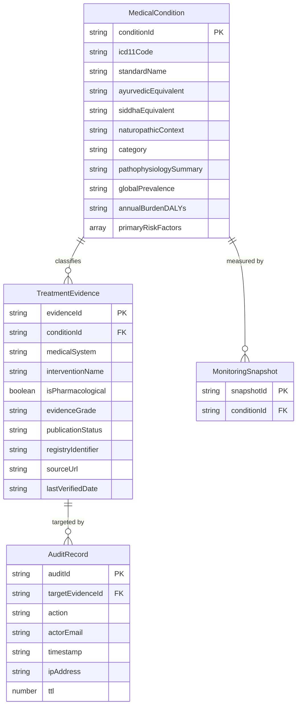

# t5 - Non-Destructive Data Compatibility And Rollback Design

## Decision Summary

The target Express 4.21 runtime uses one startup-selected persistence contract with isolated
DynamoDB-compatible and process-local memory adapters. The DynamoDB adapter reuses the existing
tables, primary keys, `byCondition` indexes, TTL attribute, and serialized field names without a
backfill, key migration, table replacement, dual write, or destructive rewrite. The memory adapter
is a non-production test/development implementation of the same observable repository semantics;
it is never an operational failover target.

Application rollback is therefore code-only: stop the target runtime and restore the prior runtime
against the same tables. Records created by the target remain valid additive records and are not
deleted during rollback. Point-in-time recovery is reserved for separately authorized recovery from
confirmed data corruption, not normal application rollback.

## Source Authority Resolution

- The active root remains authoritative for current behavior. Its `server.ts` owns the existing
  synthesis endpoint and has no server persistence contract to replace; this design adds the
  archived persistence capabilities without removing or redefining that endpoint.
- Active-root browser stores remain authoritative and unchanged: IndexedDB
  `salus_pramana_db` v1 with `recent_searches`, localStorage fallback
  `salus_recent_searches_fallback`, and localStorage subscriptions
  `salus_evidence_subscriptions_v1`.
- The archive supplies the missing DynamoDB physical contract and legacy API data shapes. Its
  implicit table-variable fallback, unpaginated reads, read-before-write ingestion, and
  non-transactional mutation-plus-audit sequence are implementation defects superseded by the
  binding architecture decisions; they are not parity behaviors to preserve.
- No target runtime may import the active root or archive at runtime. Both remain immutable parity
  references until executable validation proves the sibling implementation complete.

## Binding Data Invariants

1. Preserve table identities and the partition keys `conditionId`, `evidenceId`, `auditId`, and
   `snapshotId` as strings.
2. Preserve the evidence and monitoring GSI name `byCondition`, partitioned by string
   `conditionId`, with `ALL` projection.
3. Preserve every unknown attribute on reads. A mutation updates only fields owned by that
   operation; it must not deserialize and replace an existing item merely to normalize it.
4. Treat absent `publicationStatus` as publicly readable `published` without writing that default
   back. Accept `draft | published | rejected | under_review` in persisted reads.
5. Validate write values at the owning surface. Archived publish writes accept only
   `draft | published | rejected`; active-compatible writes accept `draft | published |
   under_review`; ingestion always creates `draft`.
6. Never infer persistence mode from table variables. Missing, unknown, or unsafe adapter
   configuration fails startup.
7. Never retry a failed DynamoDB operation against memory. Timeouts, credentials, throttling,
   network errors, and malformed responses remain persistent-store failures.
8. Every create is conditional on key absence. Every update is conditional on key existence.
   Ingestion never performs read-before-write deduplication.
9. Seed operations insert absent records only, report actual inserted counts, and never update or
   delete an existing item.
10. Verified Cognito claims supply audit identity. Bearer tokens, refresh tokens, and authorization
    headers are never persisted or logged.

## Store Topology And Compatibility

| Store | Existing physical contract | Target compatibility rule | Destructive evolution allowed |
| --- | --- | --- | --- |
| Conditions | Partition key `conditionId` | Reuse table and key; tolerate archive-only, root-extended, and future additive attributes | No |
| Evidence | Partition key `evidenceId`; GSI `byCondition(conditionId)` | Reuse table/index; preserve attribute names and status union; paginate query/scan to exhaustion | No |
| Audit | Partition key `auditId`; TTL attribute `ttl` | Append only; retain numeric epoch-seconds TTL at creation plus 90 days | No |
| Monitoring | Partition key `snapshotId`; GSI `byCondition(conditionId)` | Preserve open snapshot payload and required key/index attributes | No |
| Recent searches | IndexedDB `salus_pramana_db` v1, store `recent_searches`, key `query`, index `timestamp`; localStorage fallback | Keep browser-local contract, five-item bound, newest-first order, and existing fallback behavior | No |
| Evidence subscriptions | localStorage `salus_evidence_subscriptions_v1` | Keep browser-local shape and case-insensitive email-plus-query replacement semantics | No |
| Auth session | Existing `salus.auth.*` sessionStorage keys | Remains browser session state only and outside repository persistence | No |

No new GSI or table is required for parity. This avoids an online index build, lockstep deployment,
or rollback dependency. Full-table evidence and condition reads remain internally paginated scans;
condition-scoped evidence reads remain paginated `byCondition` queries.

## Logical Entity Model

<!-- mermaid-checked: every attribute is `<type> <name> [<key>] ["<description>"]` with at most one of PK/FK/UK, no \n in descriptions, no {} in descriptions, every relationship label is double-quoted -->

The relationship from audit to evidence is logical, not a DynamoDB-enforced foreign key. Condition
existence is enforced by the repository before evidence submission. Monitoring payload attributes
remain open because the source report owns them and DynamoDB items are schemaless beyond keys and
indexes.

## Compatibility DTOs

### MedicalCondition

The persisted compatibility DTO keeps archive fields readable and makes root-only extensions
optional when reading old records. New root-derived records may add `naturopathicContext`,
`category`, `globalPrevalence`, `annualBurdenDALYs`, and `primaryRiskFactors`. Missing root-only
fields are not backfilled into DynamoDB. Domain/UI mappers may derive display defaults, but those
defaults must not leak into persistence unless an authorized caller explicitly writes the item.

### TreatmentEvidence

The persisted compatibility DTO is the union of every archive-readable and active-root field.
Archive fields retain their serialized names and meanings. Root analytical attributes such as
`activeIngredients`, `designCategory`, effect/precision values, publication year, bias, p-value,
confidence interval, biomarker endpoint, therapeutic window, bioavailability, and half-life are
optional for old-shape reads.

Read handling is deliberately non-normalizing:

| Persisted value | Public read | Authorized draft read | Returned/persisted behavior |
| --- | --- | --- | --- |
| absent | Included | Included | Return absent; interpret as published only for filtering |
| `published` | Included | Included | Preserve verbatim |
| `draft` | Excluded | Included | Preserve verbatim |
| `rejected` | Excluded | Included | Preserve verbatim |
| `under_review` | Excluded | Included | Preserve verbatim |
| unknown future value | Excluded and surfaced as compatibility error | Excluded and surfaced as compatibility error | Never coerce or rewrite |

Mutation validation retains the four medical systems, evidence grades `A | B | C`, HTTPS evidence
source allowlist, registry prefixes `PMID | DOI | CTRI | ICTRP | AYUSH | DHARA | NCT`, and arrays
for contraindications and interaction warnings. Deterministic computation may use the established
`sampleSize=100` default where its contract requires it, but the adapter does not persist that
derived default onto an old record.

### AuditRecord And MonitoringSnapshot

Audit records contain a unique ID, action, verified actor email or `unknown`, mutation target,
ISO-8601 timestamp, optional IP address, and numeric `ttl`. They are append-only. Monitoring
snapshots preserve `snapshotId`, `conditionId`, and all report-owned attributes without projection
or replacement of existing snapshots.

## Repository Contract

Route handlers, ingestion connectors, seed logic, and clinical services depend only on these
capabilities; they never import an AWS SDK client or memory collection.

| Capability | DynamoDB-compatible semantics | Memory semantics | Observable result |
| --- | --- | --- | --- |
| `listConditions()` | Paginated scan, no write-on-read | Return a defensive snapshot | All readable records |
| `getCondition(id)` | Consistent key lookup where mutation correctness requires it | Map lookup | Record or `null` |
| `createCondition(record, audit)` | Conditional create plus audit write | Atomic check-insert plus audit append | Created or duplicate conflict |
| `updateCondition(record, audit)` | Conditional update of owned fields plus audit write | Atomic existence check/update plus audit append | Updated or missing |
| `listEvidence(query)` | Paginated GSI query or scan, then common filtering/sorting/paging | Same common filtering/sorting/paging over snapshot | Identical ordered DTO page |
| `getEvidence(id)` | Key lookup | Map lookup | Record or `null` |
| `createEvidenceDraft(record, audit)` | Conditional create plus audit write | Atomic check-insert plus audit append | Created or duplicate conflict |
| `transitionPublication(id, status, audit)` | Conditional existing-item status update plus audit write | Atomic existence check/update plus audit append | Updated or missing |
| `createImportedDraft(record)` | One conditional put on `evidenceId` | Single-process check-insert | `created` or `duplicate` |
| `seed(seedSet)` | Conditional creates only | Check-insert only | Actual inserted counts and mode |
| `appendMonitoringSnapshot(record)` | Conditional create on `snapshotId` | Check-insert | Created or duplicate conflict |

Common filtering is adapter-independent: optional condition, case-insensitive corpus query,
publication visibility, date-descending then `evidenceId` ordering, limit `1..100`, and stable
offset behavior. Sharing one pure query policy prevents DynamoDB and memory drift.

The API mutation methods should use DynamoDB transactional writes for the primary item and its
audit record so a successful response cannot represent an unaudited mutation. Condition existence
for evidence submission is a transaction condition check. The equivalent memory operation stages
both changes and commits them together. Ingestion uses a standalone conditional evidence put and
does not create an editorial audit record unless a separate product contract explicitly requires
one.

## Startup Adapter Selection

Adapter construction occurs once before Express begins listening or an ingestion job accepts work.

| Configuration | Startup result |
| --- | --- |
| `PERSISTENCE_ADAPTER=memory`, non-production | Start process-local seeded adapter |
| `PERSISTENCE_ADAPTER=memory`, production | Fail startup |
| `PERSISTENCE_ADAPTER=dynamodb`, evidence/conditions/audit tables valid | Describe and validate required keys/indexes/TTL, then start; validate monitoring when configured |
| `PERSISTENCE_ADAPTER=dynamodb`, missing or incompatible table contract | Fail startup with configuration error |
| Missing or unknown adapter | Fail startup |

Startup validation is read-only. It verifies table existence, key types, both `byCondition`
indexes when their tables are configured, audit TTL configuration, region/client configuration,
and required permissions without creating, replacing, updating, or deleting data. The monitoring
table remains optional: when absent, monitoring reports explicitly indicate that persistence did
not occur and never write to memory. A later operation failure remains an error; it does not alter
the selected adapter.

Ingestion accepts only the DynamoDB-compatible adapter in executable environments. Missing table
configuration retains the frozen structured result with all inputs skipped and a reason. A
configured store that fails must surface the error rather than convert it to a skip or memory write.

## Concurrency And Idempotency

- Evidence submission: `attribute_not_exists(evidenceId)`; duplicate maps to the frozen `409`.
- Imported evidence: `attribute_not_exists(evidenceId)`; a conditional conflict increments
  `skipped`, leaves the first item byte-for-byte unchanged, and continues.
- Seed records: conditional create per key; conflicts are retained and excluded from inserted
  counts.
- Publication: `attribute_exists(evidenceId)` and update only `publicationStatus`; missing maps to
  `404` and unrelated attributes survive.
- Condition edits: update only explicitly supplied owned fields; never use an unconditional full
  `Put` over an existing item.
- Monitoring snapshots: conditionally create by `snapshotId` to make retries idempotent.
- Batch retries: only retry AWS retryable failures with bounded SDK policy. Conditional conflicts
  are domain outcomes, not transport retries.

The legacy `saveEvidence` last-verified-date upsert is not exposed to source connectors in the
target. If a future reconciliation job needs freshness replacement, it requires a separate
conditional update comparing normalized ISO-8601 source timestamps and must never overwrite an
editorial record implicitly.

## Data Classification And Controls

| Data | Classification | Required control |
| --- | --- | --- |
| Conditions/evidence/monitoring | Public clinical research metadata; no patient record | Encryption at rest, HTTPS in transit, source allowlist, least-privilege table access |
| Audit actor email and optional IP | PII | Server-derived verified claim, no token/body logging, encryption at rest, 90-day TTL |
| Evidence-subscription email | PII in browser localStorage | Preserve current local-only scope; do not migrate server-side without a separate consent/security design |
| Auth tokens and PKCE values | Credentials/session secrets | SessionStorage only; never enter DynamoDB, memory repository snapshots, audit, or logs |

No patient-level PHI or payment-card data is present in the identified persisted model. Free-text
clinical submissions must still be treated as potentially sensitive and excluded from structured
request logs.

## Non-Destructive Rollout Procedure

1. Record table names, region/account, key schemas, GSI status, TTL status, item counts, and current
   runtime version. Capture a DynamoDB backup/PITR timestamp through the deployment process; this
   design does not execute deployment.
2. Run read-only compatibility scans against representative old-shape, absent-status,
   `rejected`, `under_review`, and additive-field fixtures. Any decode failure blocks rollout.
3. Run the shared repository contract suite against a fresh memory adapter and a disposable
   DynamoDB-compatible test environment. Never run mutation tests against production tables.
4. Validate target startup in DynamoDB mode. Missing tables, wrong keys/indexes, disabled audit TTL,
   or insufficient permissions block startup; no resource is auto-created in place.
5. Start the target runtime without seed-on-start unless an explicit seed operation is requested.
   When requested, seed uses conditional create and reports actual insert counts.
6. Exercise canary reads first, then authenticated creates and publication transitions using new
   IDs. Verify matching audit records before accepting the mutation gate.
7. Run ingestion duplicate races and confirm exactly one create, all remaining attempts skipped,
   and no overwrite.
8. Retain the active root and `archive/legacy-monorepo` unchanged until all parity gates pass.

## Rollback And Recovery

### Normal Application Rollback

1. Stop target writers and ingestion jobs.
2. Record the last target audit timestamp and runtime correlation IDs.
3. Restore the prior application runtime with the same table names and no schema action.
4. Verify prior-runtime reads of old records and target-created additive records, including absent,
   `rejected`, and `under_review` status handling.
5. Resume writers only after condition, evidence, publication, and ingestion smoke checks pass.

Normal rollback performs no delete, backfill, table restore, status translation, or attribute
stripping. Target-created records are valid business records and remain available.

### Data Recovery

PITR/backup restoration is a separate incident procedure used only after confirmed corruption and
explicit operator authorization. Restore into new recovery tables, compare by primary key and
audit timeline, and selectively reconcile verified records. Never restore over the live tables or
automatically discard post-checkpoint writes. Audit TTL means audit history older than 90 days may
not be available for reconciliation, so the recovery checkpoint must include exported audit
evidence when policy permits.

### Irreversible Or High-Risk Operations

The target implementation must not perform table replacement, key change, GSI deletion/rename,
attribute mass rewrite, type narrowing, status translation, TTL shortening, bulk delete, or
rollback cleanup. Any future request for one of these operations requires a new DBA plan, measured
item inventory, backup verification, dual-read compatibility window, and explicit approval.

## Verification Matrix

| Gate | Required evidence | Pass condition |
| --- | --- | --- |
| Physical contract | Read-only table metadata assertion | Three required keys, configured monitoring `snapshotId`, applicable `byCondition` indexes, and audit `ttl` unchanged |
| Old-shape reads | Fixtures omitting root-only fields and status | Returned without mutation; absence is public |
| Status union | Fixtures for absent and all four values | Public/editor visibility matches matrix; invalid mutation rejected |
| Adapter parity | Parameterized repository suite | Identical DTOs, ordering, conflicts, missing records, seeds, and filters |
| No silent fallback | Startup and injected-operation failures | Production memory rejected; DynamoDB failures never write memory |
| Atomic mutations | Failure injection between primary/audit effects | Neither effect commits on transactional failure |
| Ingestion race | Concurrent same-ID creates | One `created`, remaining `duplicate`, first record unchanged |
| Non-destructive seed | Seed twice over pre-existing divergent fixtures | Second run inserts zero and preserves all prior bytes |
| Pagination | More than one DynamoDB response page | Complete result with memory-equivalent stable ordering |
| Rollback read | Prior runtime against target-created fixtures | Existing routes read safely without schema migration |
| Secret handling | Log and item inspection | No token, authorization header, or request body persisted/logged |

SC-004 passes only when the same repository contract suite has zero behavioral differences, zero
destructive writes, and zero silent fallback events. Production parity remains failed until this
matrix is linked to executable test evidence by implementation and validation tasks.

## Backend And Operations Handoff

- Backend must place compatibility DTOs and repository interfaces in `persistence/contracts`, keep
  AWS SDK imports in `persistence/dynamodb`, keep process collections in `persistence/memory`, and
  inject the selected adapter into Express routes and ingestion.
- Backend must preserve route payload/status semantics while mapping typed repository outcomes
  (`created`, `duplicate`, `missing`, `invalid`, `failed`) rather than parsing AWS error strings in
  handlers.
- Operations must provide explicit adapter/table configuration and least-privilege transaction,
  query, scan, describe, and conditional-write permissions. It must not provision or mutate tables
  as an application startup side effect.
- Validation must use disposable DynamoDB-compatible storage for mutation/concurrency tests and
  read-only metadata/fixture checks for any existing environment.

## Test Results

- Command: `node -e` artifact contract validation for required sections, keys, indexes,
  conditional ingestion, rollback, upstream consumption, evidence mapping, and unresolved
  placeholder markers.
- Passed: 15 required contract markers; 0 forbidden placeholder markers; 380 artifact lines
  inspected.
- Failed: 0.
- Skipped: application build/runtime tests because this task produces a target data design and does
  not modify application source or a deployed datastore.

## Upstream Artifacts Consumed

- `.github/modernize/rearchitecture/artifacts/t2-architect.md` - supplied the 23-unit boundary,
  existing data model, shared repository contract, wire contracts, and seven binding ADRs.
- `.github/modernize/rearchitecture/artifacts/t3-pm.md` - supplied the 78-requirement inventory and
  persistence, auth, ingestion, and parity acceptance contracts.
- `.github/modernize/rearchitecture/clarification.md` - supplied the fixed target stack,
  in-place/non-destructive strategy, memory fallback requirement, current-root authority, and
  immutable archive boundary.

## Evidence Mapping

- `t2-architect.md#Architectural-Findings/ADR-01` -> status compatibility matrix, tolerant read
  rules, and surface-specific write validation.
- `t2-architect.md#Architectural-Findings/ADR-05` -> startup adapter matrix and no-silent-fallback
  verification gate.
- `t2-architect.md#Architectural-Findings/ADR-06` -> conditional imported-draft create,
  concurrency rules, and ingestion race gate.
- `t3-pm.md#REQ-064` -> additive condition/evidence compatibility DTOs and validation invariants.
- `t3-pm.md#REQ-065` -> unchanged keys/indexes, old-shape reads, and prohibited destructive
  operations.
- `t3-pm.md#REQ-066` -> shared repository contract and memory/DynamoDB parity suite.
- `t3-pm.md#REQ-067` -> transactional API mutation/audit design and audit data controls.
- `t3-pm.md#REQ-068` -> idempotent seed semantics and byte-preservation verification.
- `t3-pm.md#REQ-069` -> verified-claim audit attribution and secret-exclusion rules.
- `t3-pm.md#REQ-070..REQ-072` -> atomic ingestion, deterministic duplicate outcomes, and surfaced
  persistent-store failures.
- `t3-pm.md#SC-004` -> adapter parity and zero-destructive-write acceptance gate.
- `clarification.md#Backend` -> in-place schemas, preserved DynamoDB data, explicit local memory,
  Express 4.21/Node.js 22 boundary, and Cognito-compatible authorization context.
- `clarification.md#Generic` -> sibling rewrite scope and prohibition on deployment, Git actions,
  archive removal, and active-root capability removal.
