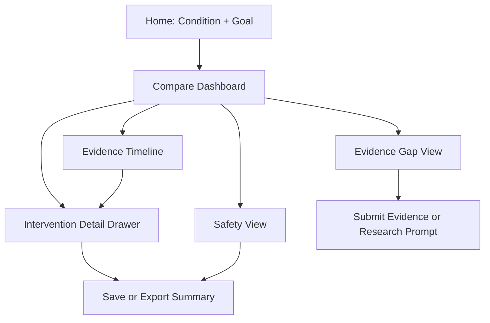

# SALUS UX Flow Blueprint

## Objective

Design a trust-first, low-cognitive-load experience for evidence-based
comparison across Allopathy, Ayurveda, Siddha, and Naturopathy.

Target outcome:

- A user can answer "What works, how strong is the evidence, and what is safe
  for me?" in under 90 seconds.
- Advanced users can drill down to methodology and source-level detail without
  overwhelming first-time users.

## Research Baseline: 25 High-UX Benchmarks

This is a curated benchmark set (not a strict rank list) of widely respected
websites and products with exemplary UX and user flow patterns.

1. Apple: clear visual hierarchy, constrained choices.
2. Airbnb: progressive filtering and map/list synchronization.
3. Stripe: narrative plus evidence-rich data storytelling.
4. GOV.UK: plain language and task completion clarity.
5. Amazon: intent-first search and resilient navigation.
6. Google Search: minimal input friction and fast feedback.
7. Notion: empty-state guidance and gentle onboarding.
8. Figma: collaborative workflow and contextual actions.
9. Linear: high-speed interaction and reduced visual noise.
10. Slack: strong information scent and channel orientation.
11. Duolingo: motivation loops and bite-sized progression.
12. Spotify: recommendation confidence via clear controls.
13. Dropbox: confidence through transparent status and versioning.
14. GitHub: scalable information architecture from novice to expert.
15. Stripe Docs: developer ergonomics and copy-paste readiness.
16. NYTimes: scannable editorial structure and typography rhythm.
17. Booking.com: decision support with trust cues.
18. Uber: location-based intent capture with low taps.
19. Headspace: calm visual language with single-primary-action screens.
20. Coda: structured complexity with modular blocks.
21. Khan Academy: progress visibility and personalized pathways.
22. HealthCare.gov: high-stakes service flow with guided steps.
23. Revolut: compact financial dashboards with clear status semantics.
24. Miro: progressive complexity and role-based entry points.
25. Shopify: merchant-first onboarding with checklist momentum.

## What SALUS Should Borrow

- From GOV.UK: plain-language summaries before technical detail.
- From Airbnb: filter chips with immediate visible impact.
- From Stripe: credibility via transparent methodology and metrics.
- From Apple: deliberate whitespace and strict visual hierarchy.
- From Linear: speed and keyboard-first interaction for experts.

## Product Principle

"Show confidence first, detail on demand."

## Experience Pillars

1. Intent first User starts with condition and goal, not with raw data tables.

2. Trust by design Every recommendation panel links to source quality, date, and
   contraindications.

3. No dead ends Every screen has one primary next action.

4. Progressive disclosure Core answer first, advanced analysis expandable.

5. Safety always visible Interaction risks and contraindications never hidden
   behind deep tabs.

## Primary User Flows

### Flow A: Patient / Caregiver (quick understanding)

1. Enter condition (search or pick common conditions).
2. Choose objective (reduce symptoms, prevent progression, improve quality of
   life).
3. See comparison dashboard (top interventions by confidence and safety).
4. Open one intervention card for plain-language summary.
5. Review safety block and discuss-with-clinician checklist.

### Flow B: Clinician (evidence validation)

1. Enter condition and patient profile constraints.
2. Sort by evidence confidence and recency.
3. Open evidence detail drawer with methodology, sample size, endpoints.
4. Check interaction matrix for current meds.
5. Export summary packet with citations.

### Flow C: Researcher / Editor (deep analysis)

1. Condition-level landscape view.
2. Explore gap heatmap and convergence clusters.
3. Drill into source registry records.
4. Flag candidate areas for trial prioritization.
5. Save workspace and share.

## Proposed IA (Information Architecture)

Top nav:

- Explore Conditions
- Compare Interventions
- Safety & Interactions
- Evidence Gaps
- Submit Evidence

Condition page sections:

1. Instant Answer Strip
2. Top Intervention Cards
3. Confidence vs Safety Chart
4. Evidence Timeline
5. Interaction and Contraindication Panel
6. Methodology and Source Table (collapsed by default)

## Screen Blueprint (Low-Overwhelm)

### 1. Home: Intent Capture

Primary action: "Compare options"

- Condition autocomplete
- Goal selector (3 to 5 options max)
- Persona mode toggle (Patient, Clinician, Researcher)

### 2. Compare: Decision Dashboard

First viewport should contain:

- One sentence answer summary
- 3 ranked intervention cards
- Safety alert banner only if relevant

Each intervention card includes:

- Confidence score (0 to 100)
- Evidence grade (A/B/C)
- Recency marker
- Benefit summary in plain language
- "Why this rank" expandable reason

### 3. Evidence Deep Dive

Tabbed detail drawer:

- Summary
- Methods
- Studies
- Risks
- Heritage chain (for traditional systems)

### 4. Safety View

- Interaction matrix with current meds/herbs
- Contraindication chips by profile (pregnancy, diabetes, liver, renal, etc.)
- Severity and confidence for each warning

### 5. Evidence Gaps View

- Condition map segmented by confidence sufficiency
- "Where research is missing" narrative panel
- CTA: submit case data or propose trial question

## Chart Strategy: Most Intuitive for SALUS Data

Avoid charts that are visually impressive but cognitively expensive for
non-experts.

1. Confidence Ladder (horizontal bullet chart) Use for ranking interventions by
   confidence and showing threshold bands. Why: instantly comparable and highly
   scannable.

2. Benefit-Risk Quadrant (scatter plot with labeled clusters) Use for quick
   decision framing. X-axis: expected benefit. Y-axis: risk burden. Why: strong
   mental model for tradeoffs.

3. Evidence Timeline (stacked timeline with recency fade) Use for seeing
   freshness and replication trend over years. Why: communicates "old vs new" at
   a glance.

4. Interaction Matrix (heatmap table) Use for drug-herb-food interactions. Why:
   matrix reading is natural for pairwise risk checks.

5. Gap Heatmap (condition categories grid) Use for red/amber/green evidence
   sufficiency by condition family. Why: highlights unmet research zones
   instantly.

6. Convergence Graph (optional advanced view only) Use for cross-system pathway
   convergence. Why: valuable for experts, but should remain behind an
   "Advanced" toggle.

## Anti-Overwhelm Rules

1. One primary CTA per screen.
2. Default to 3 cards, not infinite lists.
3. Collapse all advanced panels by default.
4. Keep sentence length short in summaries.
5. Use status colors only for safety semantics, not decoration.
6. Never show more than 2 chart types above the fold.
7. Preserve user context while switching tabs (no reset surprise).
8. Show clear loading skeletons and response-time feedback.

## Copy and Language System

- Plain language first: "How strong is the evidence?" then "methodological
  quality".
- Explain uncertainty explicitly: "Moderate confidence due to small sample
  size".
- Avoid deterministic medical claims.

## Interaction Design Rules

- Keyboard-first search and filtering.
- Sticky context bar showing selected condition, goals, and profile.
- Hover tooltips for experts, inline text for novices.
- Undo-friendly filters with visible "Reset" and "Applied filters" chips.

## Accessibility and Inclusivity Baseline

- WCAG 2.2 AA contrast.
- Do not encode meaning by color alone.
- Chart patterns and labels for color-blind accessibility.
- Screen-reader descriptions for chart summaries.
- Mobile-first adaptation with card stacks and simplified chart modes.

## Suggested Visual Direction

- Calm clinical palette: off-white background, slate text, restrained accent
  colors.
- Large readable typography with strong scale contrast.
- Generous whitespace and card grouping to reduce cognitive load.
- Motion only for state change and hierarchy reinforcement.

## End-to-End UI Flow Diagram

## Success Metrics

Primary:

- Time to first confident decision under 90 seconds.
- Safety checks viewed before export in at least 70% of sessions.

Secondary:

- Reduction in filter abandonment.
- Increase in deep-dive engagement for clinician persona.
- Higher evidence submission completion rate.

## Delivery Plan (Recommended)

Phase 1:

- Intent capture home
- Compare dashboard with confidence ladder + safety strip

Phase 2:

- Evidence deep dive drawer
- Interaction matrix

Phase 3:

- Gap heatmap and convergence advanced mode
- Export and persona-specific summaries

## Notes on "World-Class" Positioning

The strongest path to world-class UX is not adding more visual complexity. It is
reducing ambiguity, reducing decision effort, and increasing trust through
transparent evidence and safety communication.
